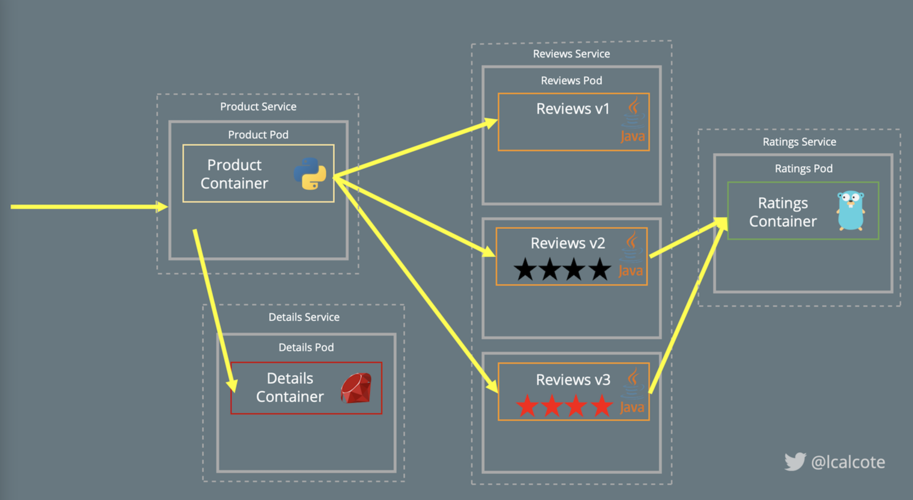

# Istio

# Getting Started
```
$ curl -L https://git.io/getLatestIstio | sh -
```

Specific Version
```
$ curl -L https://git.io/getLatestIstio | ISTIO_VERSION=1.1.0 sh -
```

## Pre-check
```
$ istioctl x precheck
```

# Install
```
$ istioctl install --set profile=demo -y

✔ Istio core installed
✔ Istiod installed
✔ Egress gateways installed
✔ Ingress gateways installed
✔ Installation complete                                                         
```

# Verification
```
$ istioctl proxy-status
```

## Add a namespace label 
to instruct Istio to automatically inject Envoy sidecar proxies when you deploy your application later:
```
$ kubectl label namespace default istio-injection=enabled
namespace/default labeled
```

## Bookinfo Sample


```
$ kubectl apply -f https://raw.githubusercontent.com/istio/istio/release-1.12/samples/bookinfo/platform/kube/bookinfo.yaml
```

### Verfication
```
$ kubectl exec "$(kubectl get pod -l app=ratings -o jsonpath='{.items[0].metadata.name}')" -c ratings -- curl -sS productpage:9080/productpage | grep -o "<title>.*</title>"
<title>Simple Bookstore App</title>
```

### Open the application to outside traffic

```
$ kubectl apply -f https://raw.githubusercontent.com/istio/istio/release-1.12/samples/bookinfo/networking/bookinfo-gateway.yaml
```

#### Ensure that there are no issues with the configuration:
```
$ istioctl analyze
✔ No validation issues found when analyzing namespace: default.
```

### Testing
```
$ export INGRESS_HOST=$(kubectl get po -l istio=ingressgateway -n istio-system -o jsonpath='{.items[0].status.hostIP}')

$ export INGRESS_PORT=$(kubectl -n istio-system get service istio-ingressgateway -o jsonpath='{.spec.ports[?(@.name=="http2")].nodePort}')


$ export GATEWAY_URL=$INGRESS_HOST:$INGRESS_PORT

$ echo "$GATEWAY_URL"/productpage

echo "http://$(kubectl get nodes -o template --template='{{range.items}}{{range.status.addresses}}{{if eq .type "InternalIP"}}{{.address}}{{end}}
{{end}}{{end}}'):$(kubectl get svc istio-ingressgateway -n istio-system -o jsonpath='{.spec.ports[0].nodePort}')/productpage"
```

# Prometheus
```
$ kubectl apply -f https://raw.githubusercontent.com/istio/istio/release-1.12/samples/addons/prometheus.yaml
```

# Grafana
```
$ kubectl apply -f https://raw.githubusercontent.com/istio/istio/release-1.12/samples/addons/grafana.yaml
```
# Kiali Dashboard
```
$ kubectl apply -f https://raw.githubusercontent.com/istio/istio/release-1.12/samples/addons/kiali.yaml

$ kubectl rollout status deployment/kiali -n istio-system

$ kubectl port-forward -n istio-system kiali-79b86ff5bc-zxtdc --address=0.0.0.0 20001
```

# Uninstall
<code>
$ kubectl delete -f https://raw.githubusercontent.com/istio/istio/release-1.12/samples/addons/kiali.yaml

$ kubectl delete -f https://raw.githubusercontent.com/istio/istio/release-1.12/samples/addons/grafana.yaml

$ kubectl delete -f https://raw.githubusercontent.com/istio/istio/release-1.12/samples/addons/prometheus.yaml

$ kubectl delete -f https://raw.githubusercontent.com/istio/istio/release-1.12/samples/bookinfo/networking/bookinfo-gateway.yaml

$ kubectl delete -f https://raw.githubusercontent.com/istio/istio/release-1.12/samples/bookinfo/platform/kube/bookinfo.yaml

$ istioctl manifest generate --set profile=demo | kubectl delete --ignore-not-found=true -f -

$ istioctl tag remove default

$ kubectl delete namespace istio-system

$ kubectl label namespace default istio-injection-
</code>